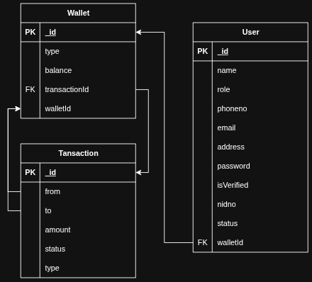

# 💰 Digital Banking System

## 🎯 Project Overview

A secure, modular, and role-based backend API for a digital wallet system (like Bkash or Nagad) using **Express.js** and **Mongoose**. This backend supports registration, wallet operations (add, withdraw, send money), role-based authentication for `user`, `agent`, and `admin`, and full transaction tracking.

---

## 📦 Tech Stack

- Node.js
- Express.js
- TypeScript
- Mongoose (MongoDB)
- JWT (Authentication/Authorization)
- bcrypt(Password Hashing)

---

## ✅ Features

### 🔐 Authentication
- Secure login with JWT
- Password hashing via bcrypt
- Role-based system: `admin`, `user`, `agent`

### 👤 User & Wallet Management
### Wallet auto-created at registration (initial balance TK50)
#### Users can:
- Add money request to agent
- Withdraw money
- Send money to users
- View his info, wallet and one/all transactions
- Update basic info and password


### 🧑‍💼 Agent Capabilities
#### Agents can:
- Cash In to users directly
- Accept add money request made to him
- Withdraw money (cash-out)
- Send money to agents
- View his info, wallet and one/all transactions
- Update basic info and password

### 🛠️ Admin Controls
- View one/all users, agents, wallets, transactions
- Block/unblock/delete users and agents
- Appoint users agents or vice versa
- Update users, agents, wallets, transactions,
- Provide refund for completed transactions

### 🔁 Transaction System
- Tracks type, amount, status, and wallet IDs
- Supports PENDING, COMPLETED, FAILED, REFUNDED statuses
- Safe and atomic via Mongoose sessions

---

## 📁 Folder Structure

```
sakincse21-digital-banking-system/
├── src/
│   ├── app.ts                    
│   ├── server.ts                 
│   ├── app/
│   │   ├── config/               
│   │   ├── errorHelpers/        
│   │   ├── interface/            
│   │   ├── middlewares/        
│   │   ├── modules/              
│   │   ├── routes/               
│   │   └── utils/                
│   └── ...
├── .env                  
├── package.json
├── tsconfig.json
└── vercel.json                   
```

---

## 🗃️ Model Structures

[]

### **User Model**
```typescript
interface IUser {
  name: string;
  phoneNo: string;
  email: string;
  role: IRole; // 'AGENT' | 'ADMIN' | 'USER' | 'SUPER_ADMIN'
  address: string;
  password: string;
  isVerified: boolean;
  nidNo: string;
  status: IStatus; // 'ACTIVE' | 'SUSPENDED' | 'BLOCKED' | 'DELETE'
  walletId: Types.ObjectId; // Reference to Wallet
}
```

### **Wallet Model**
```typescript
interface IWallet {
  balance: number; // Minimum 0, default 50
  transactionId: Types.ObjectId[]; // Array of Transaction references
  userId: Types.ObjectId; // Reference to User
  walletId: string; // Unique (phone number for better user experience)
}
```

### **Transaction Model**
```typescript
interface ITransaction {
  from: string; // Sender's walletId (phone number)
  to: string; // Receiver's walletId (phone number)
  amount: number; // Minimum 5 for sending money
  status: ITransactionStatus; // 'PENDING' | 'COMPLETED' | 'REFUNDED' | 'FAILED'
  type: ITransactionType; // 'SEND_MONEY' | 'ADD_MONEY' | 'WITHDRAW' | 'CASH_IN' | 'REFUND'
}
```

---

## 🚀 Project Setup

### ⚙️ Environment Setup

Create a `.env` file in the root and defined in `.env.example`

### 📦 Installation

```bash
git clone https://github.com/sakincse21/Digital-Banking-System.git
cd Digital-Banking-System
npm install
```

### 🏃 Run the App

```bash
npm run dev
```

---

## 📬 API Endpoints Overview

| Module       | Endpoint                                | Method | Description                     | Auth Required             |
|--------------|-----------------------------------------|--------|---------------------------------|---------------------------|
| Auth         | `/api/v1/auth/login`                    | POST   | User login                      | No                        |
| User         | `/api/v1/user/create`                   | POST   | Create user                     | No                        |
|              | `/api/v1/user/me`                       | GET    | Get logged-in user info              | Yes                       |
|              | `/api/v1/user/:id`                      | GET    | Get user by ID                  | Admins                     |
|              | `/api/v1/user/all-users`                | GET    | Get all users                   | Admins                     |
|              | `/api/v1/user/update-password`          | PATCH  | Update own password                 | Yes                       |
|              | `/api/v1/user/:id`                      | PATCH  | Update own info                     | yes                |
|              | `/api/v1/user/admin/:id`                | PATCH  | Update important/financial info              | Admins                     |
|              | `/api/v1/user/:id`                      | DELETE | Delete user                     | Admins                     |
| Wallet       | `/api/v1/wallet/:id`                    | GET    | Get own wallet                      | User/Admins                |
|              | `/api/v1/wallet/wallet-id/:phone`       | GET    | Get own wallet by phone             | User/Admins                |
|              | `/api/v1/wallet/`                       | GET    | Get all wallets                 | Admins                     |
|              | `/api/v1/wallet/:id`                    | PATCH  | Update wallet                   | Admins                     |
| Transaction  | `/api/v1/transaction/`                  | GET    | Get own all transactions            | User/Admins                |
|              | `/api/v1/transaction/:id`               | GET    | Get own transaction by ID           | User/Admins                |
|              | `/api/v1/transaction/send-money`        | POST   | Send money to same role                      | User/Agent                |
|              | `/api/v1/transaction/add-money`         | POST   | Request add money to agent               | User                      |
|              | `/api/v1/transaction/add-money-confirm/:id` | POST   | Confirm add money request made           | Agent                     |
|              | `/api/v1/transaction/withdraw`          | POST   | Withdraw money                  | User                      |
|              | `/api/v1/transaction/cash-in`           | POST   | Cash in money                   | Agent                     |
|              | `/api/v1/transaction/refund/:id`        | POST   | Refund transaction              | Admins         |

---

## 🛠️ Testing

- Import the [Postman Config](https://github.com/sakincse21/Digital-Banking-System/blob/main/postman-config.json) file into Postman and test accordingly.

---

## Video

[](https://youtu.be/Pjn9PS_1MkI)

---

## 📄 Author

👨‍💻 Saleheen Uddin Sakin  
[GitHub](https://github.com/sakincse21) | [LinkedIn](https://www.linkedin.com/in/saleheen-sakin/)

---
